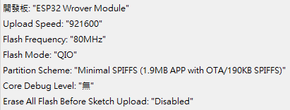

# ESP32_CAM 使用手冊

## 簡介

`ESP32_CAM` 是一個專為 ESP32-CAM 模組設計的軟體應用，它能夠捕捉並透過網路分享相機的即時影像。它提供了一個用戶友好的方式來遠程查看和監控您的攝像頭。

## 特點

- **簡單易用**: 無需複雜的設置或配置。
- **即時影像分享**: 實時捕捉並通過網路分享您的攝像頭影像。
- **定時通知**: 每天在特定時間接收攝像頭的運行狀態通知。

## 快速上手指南

1. **安裝和配置**
   - 確保您的 ESP32-CAM 模組已正確安裝並連接到互聯網。
   - 下載並安裝 `ESP32_CAM` 應用到您的裝置。

2. **啟動應用**
   - 打開 `ESP32_CAM` 應用。
   - 應用會自動連接到您的攝像頭並開始顯示實時影像。

3. **接收通知**
   - 您將每天在設定的時間（例如7點）收到一個包含攝像頭運行狀態和影像連結的通知，關於LINE TOKEN的取得可以參考[EDU01M測試模組說明](https://github.com/cypswu/EDU01M_Demo/tree/master/Demo/%E6%95%B4%E5%90%88%E6%B8%AC%E8%A9%A6)。

4. **查看實時影像**
   - 點擊收到的通知中的連結，即可查看您攝像頭的實時影像。

5. **韌體配置**
   - 

## 功能與命令

- **初始功能** WiFi或MQTT超過10分鐘無法連線，或AP配置超過6分鐘無法連線就重啟設備。
- **GPIO13按鈕** 在開機時，按下超過3秒進入AP模式，超過10秒清除所有設置。
- **reboot** 重啟設備，Serial命令可支援。
- **reset_wifi** 重設WIFI配置，Serial命令可支援。
- **update** 更新韌體。
- **capture** 獲取當前影像。
- **led on/off/?/pin_4** 補光燈開啟、關閉、狀態、PIN腳。
- **img qvga/(vga)/svga/xga/sxga/uxga** 改變相機解析度。
- **mode grayscale/(color)** 更改灰度或彩色相機(目前不支援灰度)。
- **mode image/stream/stop** 開啟圖流網頁或串流網頁或關閉串流。
- **sd on** 啟動SD卡模組保存，預設不啟動SD卡儲存。

## 常見問題解答

**問題**: 我無法連接到我的攝像頭，應該怎麼辦？
**答案**: 請確保您的 ESP32-CAM 模組已正確安裝並連接到互聯網。

**問題**: 我沒有按時收到通知，怎麼辦？
**答案**: 請檢查您的互聯網連接和 `ESP32_CAM` 應用的通知設置。

**問題**: 我可以更改通知的時間嗎？
**答案**: 目前版本不支持這個功能，未來的版本可能會增加這個功能。

**問題**: 第二次開啟串流無法連線
**答案**: V1005已解決此問題，如無法發送圖像，可用命令重啟(reboot)試試。

## 支持

如果您在使用 `ESP32_CAM` 應用時遇到任何問題或需要技術支援，請聯繫我們的客服團隊。

感謝您使用 `ESP32_CAM`！祝您使用愉快！
